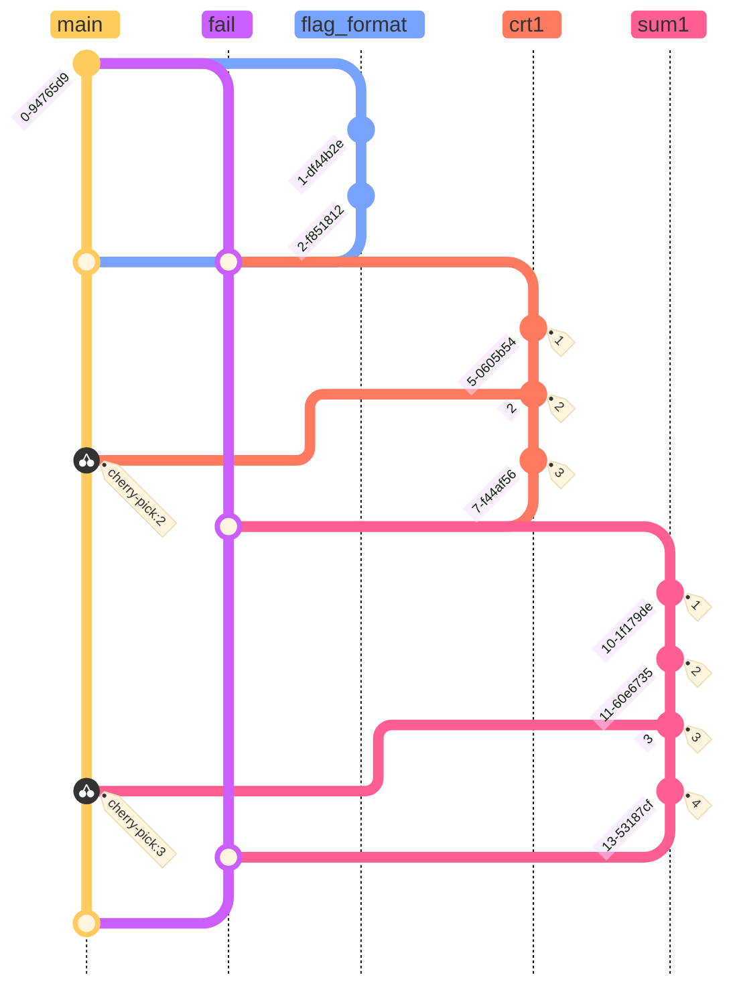

# cursedCTF 2024 - cursed writeup
🎉🎉 Cursed CTF run for the second year 🎉🎉

During HITCON CTF Final, I met some of the admins for cursedCTF, and joined the admin team. In the end, I posted 6 challenges. I hope that everyone enjoyed the cursedness of this competition.

<!--more-->

I always love the idea of a troll competition during April fools. When I used to be an active competitive programming player, some friend will host these april fools competitions, each with different gimmicks. That transfer to CTFs as well. I played XMAS-GTF in 2020 and the first cursedCTF last year, and I truely enjoy those experiences. 

Last year I met some of the admins at HITCON CTF final and get to join the admin team! This is the first time being able to contribute to this event and I certain enjoy my time. 
## Some (cursed) statistics
- 11058 teams that scored at least 1 flag
- 101 total challenges
- 1 challenge with 9606 solves
- 2 often used flag formats
- 2 challenges with no flag format
- 2+ leaked flags
- 4+ flags traded with contestants
- 1 admin playing as contestant
- 2 players banned
- 4 challenges requires real money
- 2 challenges reused
- Competition ended 3 times
> (I'll add more as I gathered more information)

## My challenges
Well I guess I should post writeups of my own challenge.
I'll order it roughly by my own percieved cursedness

### forensic - fetusstego
```
another easy stego
```

This one is probably the most normal ctf challenge I created. 
The only cursed part is merely that it's a stego. 
There isn't really any twist to it, just guessed how the image is created. 

So the image is created by 36 images, each with a single word.
The pixels are then "zipped" together such that each 6 by 6 mega pixel contains the pixel from each image in order.
The solution is simply to extract the 36 images back out, which each contains a letter from the flag.

### osint - Geogusser-Extreme 2
````
Guess the coordinate from the description

```
cursed.free.flag
```

the flag format is cursedctf{12.456789,-123.340000}
````
This challenge is created to be "Solvable by dcode.fr" bingo block in mind. 
I totally missed the part where the bingo said "crypto challenge".
I thought: How can I pick a dcode functionality that isn't obvious, so it's technically solvable by dcode.fr but it's actually a bit harder than that. 
Then in the geography section I found the [what3word](https://www.dcode.fr/what3words-coordinates) option, and decide Yeah this is what I want. 
Hence this challenge.

Well the solution is obviously just going to dcode.fr, and put the description in, then you'll get the flag. 
Wrap it in flag format and you'll get  `cursedctf{65.826986,-113.171834}`

### osint - Geogusser-Extreme
````
Guess the coordinate from the description

```

```

the flag format is cursedctf{123.456789,12.340000}
````

Before I started to create any challenge, Emma1 already created all the geogusser challenges, but there seems to still be a lack of geogusser challenges (yeah there's never enough geogusser!).
So I think? What is the simplist geogusser? Or else, what's the minimal hints needed to guess a location. 
I then remember the null island.
That's obvious a good place to guess! 
With an empty description, people would be able to get that it's the null island and guess the all zero coordinate!
And this challenge is born, the flag is obviously `cursedctf{0.000000,0.000000}`

### crypto - crypto curses
````
You've stumbled upon a strange website where everything seems to be encrypted. There's a message written on the homepage:

```
Cursed Cryptography Challenge:

Can you break the curse and find the hidden flag?
Remember, the flag format is cursed{\w+}
```

Your task is to decrypt the following ciphertext to reveal the flag:

```
Ciphertext:
Uijt jt b tfdsfu nvdi. Ju't b dpnjoh bddftt, cvu ju't tqfoejoh ijn xjui b xfflt."
```
````
This challenge is created by chatgpt™️.
Jokes aside, I was originally hoping that chatgpt can legitimate create a cohesive challenge, with a reasonable flag. 
It end up being a lot less stable when it comes to encrypting and decrypting things.
Let's take this exact challenge for example, the challenge ciphertext is supposedly a caeser cipher of the plaintext `This is a secret message. It's a coming after, but it's spending him with a weird.`.
If you tried to decrypt the ciphertext yourself, however, you'll quickly find out it's actually encryption of `	This is a secret much. It's a coming access, but it's spending him with a weeks."`.
Not to mention that chatgpt end up stating that the flag should be `cursed{secret}` with totally no logic.

> Well obviously cause chatgpt doesn't have logic, it's just a transformer* guessing the next token basic on previous sentences

So the original idea of just posting the challenge description would utterly fail, as no one would probably guessed it correctly.
The next idea is to use some sort of pixelation on the code block, and intended for people to use tools such as [Depix](https://github.com/spipm/Depix) to recover the content.
This would have been a cool idea actually, but I can't find a good pixelation app that I'm confident to be "solvable" (I guess challenges don't really have to be solvable in cursed ctf anyway) 

In the end, I decided that maybe if the original chat log is leaked in some form, so people can just look at the correct flag, and there will be less confusion.
I cropped the chat such that the sharable link is shown in the navigation bar, with just 1 character cropped out.
I can maybe crop out a lot more characters, but I'm afraid that it'll end up become a DDOS attack toward chatgpt.
Though in hindsight, two or even three character (so 4096 possible urls) should be fine.  
[Link to the chat](https://chat.openai.com/share/5a19884d-dc6f-421a-b5ea-153cbbce3877)

Here some other trials I made before settling with the above conversation

[Link to trail conversation](https://chat.openai.com/share/62c5cf1b-e226-44ae-9d79-67f4cc42ef14)

In this one I was hoping that an odd request message can somehow forced chatgpt to include it in the flag somehow in a somewhat more reasonable manner. 
> Seems like I can't show multiple options choosen during the course of conversation...


### forensic - babystego
```
Wow I make a image with the flag in powerpoint =D
  
hint - replace the flag format to `cursedctf{.*}` when you found the flag
```
As the description suggested, this challenge is indeed made by powerpoint.
There are two cursedness in this challenge. 
The original idea is to create a stego challenge where the flag is right in front of you the whole time, but people wouldn't believe it. 
So the simple way to do this is just put the flag right in the middle of the image, but add various rabbit holes around the image.
What in totally missed is that I wrote `cursed{I~AM~FLAG}` in the image, while I setup the challenge to accept `cursedctf{I~AM~FLAG}`.
I didn't notice this until the last day of the competition, and released the hint to fix that, as this was not the intended difficulty of this challenge.
It's very funny though, I did spend some time deciding if I want to keep it as is since like 20 people already guessed it. 
### misc - check-sanity
```
`cursedctf{cursedctf{cursedctf{cursedctf{cursedctf{cursedctf{flag}}}}}}`
```
For this challenge, the idea is that normally you always submit flag according to the description? 
So then the cursed thing is the reverse, to submit the description according to the flag? 
Obviously you'll need a flag that almost everyone would have gotten, which would be sanity check. 

Now if you look at sanity-check, the description said `haha i claimed the best challenge` and the then the flag.
So, the flag for check-sanity is `haha i claimed the best challenge`. 
Well I did made the arbitrary decision of truncating out the flag part. 
I hope that his doesn't hindered anyone with the right idea but end up not getting the flag.

Half way through the competition I thought that this challenge shouldn't be that hard, but no one is getting it. 
I then saw that we had a #leaked-flags channel, and think: Huhhh it'll be funny if the leaked flags channel actually contains a real flag. 
Since the flag for this challenge doesn't have the flag format, it's the perfect candidate as people wouldn't notice that it's actually a valid flag. I then post a lot of fake flags along with that, and announced the "One Piece" in the leaked-flags channel. 


### rev - git madness
```
JDSL... but in git????
ps - it only took 4 minute on my machine to check the flag =D that's blazingly fast
```

This is the challenge that really drives me into contributing to this year's cursedCTF. 
I was watching YouTube and saw [The Most Amazing  Software Ever Created](https://youtu.be/QwUPs5N9I6I?si=ysqZbXkNaN5o6bYB), which is a reaction video to [The inner json effect](https://thedailywtf.com/articles/the-inner-json-effect). 
The only thought I have after this is.
> This is sooooo cooool, what if this is a CTF challenge.

Well some part obviously need to change.
I'm more familiar with git, so I think I'll built a similar system with git.
Also, this might not be suitable for a normal CTF. (I'm createing challenges for b01lersCTF as well!! Stay Tune!!)
Oh, cursed ctf is around the corner and I did join the admin team, I should just put it there. 

All of that happened like 1 week before the competition, and I don't have much time, so I quickly brew up a prototype and made this schematic. 



Yeah that seems cool, we can use the git head and the git commits as states and pointers. Now we can basically implement a finite state machine using git! Some possible thing I could add to the challenge are
- [x] Randomize branch name
- [x] Randomize commit name  
- [x] Randomize commit time
- [x] Randomize tree layout
- [ ] Multiple languages
- [ ] Obfuscated Constants in different languages
- [ ] ... maybe more ideas


Due to the time constaints, I can only implement the checking part as simple as I could while still abusing git's state machine.
I use shellscript as the main language, and just call git directly to manipulate the state.
The idea is that each branch head acted like an anchor, while `git checkout HEAD^` or `git checkout HEAD~x` serves as the way to move the pointer around.
Due to the limitation of git, you can only move the pointer in one direction, namely toward the parent.

For the flag format part, I just check each character one by one.
Then I have a section which does a "matrix multiplication", which is just adding some position values together and see if they match the target sum value.
I achieve summation check by having the target number of commits on the branch, and for each character input, you move that many commits toward the parent.
After a certain number of jumps, if we land on the correct commit (state), then the check passes.
The rest of the flag is checked through several modulo checks. 
Having git go to parents several times with on of the commit going back to the branch head, we can have some sort of modulo operation, and hard code the result commit.

I would hope that I can implement all the "features" and integrate more interesting ways to move on this "state machine", but run out of time.
Also, I think this challenge is cursed enough as is.
`jospeh fan club` is the only team that end up solves it.
I'd hope if more people attempted it, but having a solve is already more than what I expected. 


## Conclusion
I really hope that everyone participated in this event have a fun time.
I truely enjoyed the whole process, and would look forward for next year (or finals!).
That'll be a wrap for curseddCTF 2024 qual!

---

\*: I'm not actually sure if chatgpt is using transformer under the hood, I'll probably need more research into it to find out
